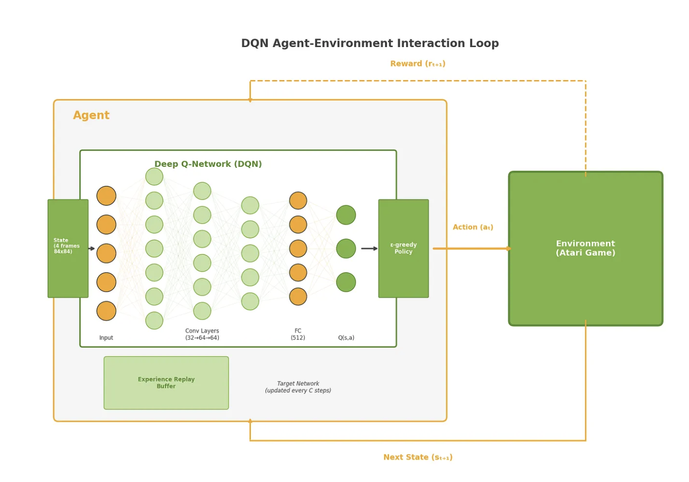

# Atari Games - Deep Reinforcement Learning



## Task
Train deep reinforcement learning agents to play classic video games (CartPole, Space Invaders, and Pac-Man) using only raw pixel observations and reward signals. The challenge is implementing a DQN architecture that learns effective policies from high-dimensional visual input without game-specific feature engineering.

## Description
This project implements Deep Q-Network (DQN) agents following the approach from DeepMind's seminal papers. Key features:

- **Double DQN**: Reduces overestimation bias by decoupling action selection from evaluation
- **Prioritized Experience Replay**: Samples important transitions more frequently based on TD-error
- **NoisyNet exploration**: Optional parameter-space noise for more efficient exploration
- **n-step returns**: Multi-step bootstrapping for faster credit assignment
- **Frame preprocessing**: Grayscale conversion, downsampling to 84x84, and 4-frame stacking

### Results

| Game | Frames Trained | Episodes | Score Range |
|------|----------------|----------|-------------|
| CartPole | 200k | 1,655 | 22-262 |
| Space Invaders | 2.4M | 4,326 | 23-35 |
| Pac-Man | 2.6M | 6,852 | 68-119 |

## Installation

```bash
# Clone the repository
git clone <repo-url>
cd atari_games

# Create and activate virtual environment
python -m venv .venv
source .venv/bin/activate

# Install dependencies
pip install -r requirements.txt

# Install Atari ROMs (required for Space Invaders and Pac-Man)
pip install autorom
autorom --accept-license
```

## Usage

### Training

```bash
# Activate environment
source .venv/bin/activate

# Train CartPole (fastest, good for testing)
python train/train_cartpole.py --config configs/cartpole_m1_fast.json

# Train Space Invaders
python train/train_atari.py --config configs/space_invaders_m1_fast.json

# Train Pac-Man
python train/train_atari.py --config configs/pacman_m1_fast.json
```

### Evaluation

```bash
# Evaluate a trained model
python eval/eval_agent.py --model models/CartPole-v1_latest.pt --env CartPole-v1
python eval/eval_agent.py --model models/ALE_SpaceInvaders-v5_latest.pt --env ALE/SpaceInvaders-v5
python eval/eval_agent.py --model models/ALE_MsPacman-v5_latest.pt --env ALE/MsPacman-v5
```

### Fast training on M1/M2 (CPU recommended)

These configs apply faster DQN settings and run on CPU, which benchmarks show is faster than MPS for this project.

```bash
source .venv/bin/activate
python train/train_cartpole.py --config configs/cartpole_m1_fast.json
python train/train_atari.py --config configs/space_invaders_m1_fast.json
python train/train_atari.py --config configs/pacman_m1_fast.json
```

Turbo (NoisyNet + update-every-frame + strong early stop targets):

```bash
source .venv/bin/activate
python train/train_cartpole.py --config configs/cartpole_m1_turbo.json
python train/train_atari.py --config configs/space_invaders_m1_turbo.json
python train/train_atari.py --config configs/pacman_m1_turbo.json
```

Max-speed Pac-Man (CPU thread tuned):

```bash
source .venv/bin/activate
python train/train_atari.py --config configs/pacman_m1_max.json
```

## Project Structure

```
src/atari_games/    # Core library (agent, networks, replay buffer, trainer)
train/              # Training entry points
eval/               # Evaluation scripts
configs/            # JSON experiment configurations
models/             # Trained checkpoints (gitignored)
reports/            # Training metrics and logs
```

### The Core Team


<span><i>Made at <a href='https://qwasar.io'>Qwasar SV -- Software Engineering School</a></i></span>
<span></span>
